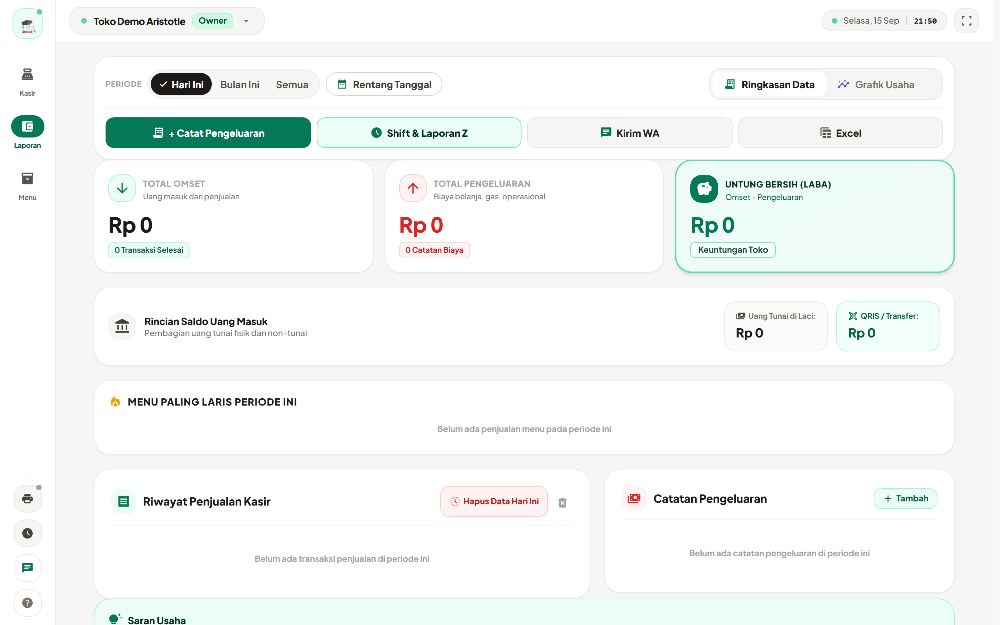
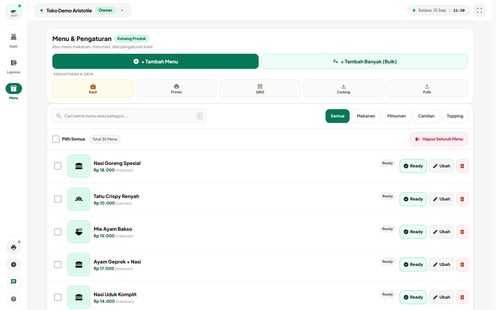
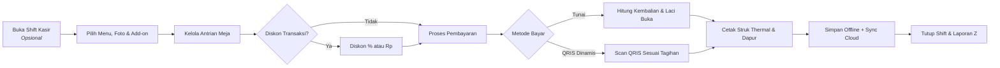

<p align="center">
  
</p>

<h1 align="center"><a href="https://miezlearning.github.io/aristotle-pos/">Aristotle POS</a></h1>

<p align="center">
  <strong>Sistem Kasir Pintar, Modern, dan Skalabel untuk UMKM & Retail F&B Indonesia</strong><br>
  <em>Dirancang dengan filosofi Effortless UI: Sangat mudah digunakan, ramah lansia, 100% offline-first, foto menu visual, dan siap terhubung ke cloud.</em>
</p>

<!-- AUTO-SYNC CORE STATUS BADGES -->
<p align="center">
  <a href="https://github.com/miezlearning/aristotle-pos/releases/latest">
    
  </a>
  <a href="https://github.com/miezlearning/aristotle-pos/actions/workflows/ci-cd.yml">
    
  </a>
  <a href="https://github.com/miezlearning/aristotle-pos/releases/latest/download/Aristotle-POS.apk">
    
  </a>
  <a href="https://miezlearning.github.io/aristotle-pos/">
    
  </a>
  <a href="LICENSE">
    
  </a>
</p>

<!-- REPO ENGAGEMENT & VITAL STATS ROW -->
<p align="center">
  <a href="https://github.com/miezlearning/aristotle-pos/stargazers">
    
  </a>
  <a href="https://github.com/miezlearning/aristotle-pos/network/members">
    
  </a>
  <a href="https://github.com/miezlearning/aristotle-pos/releases">
    
  </a>
  <a href="https://github.com/miezlearning/aristotle-pos">
    
  </a>
  <a href="https://github.com/miezlearning/aristotle-pos/commits/master">
    
  </a>
  <a href="android/app/build.gradle">
    
  </a>
</p>

<!-- QUICK ACTION HERO LINKS -->
<p align="center">
  <a href="https://miezlearning.github.io/aristotle-pos/">🚀 <b>Buka Web App (Live Demo)</b></a> &nbsp;•&nbsp;
  <a href="https://github.com/miezlearning/aristotle-pos/releases/latest/download/Aristotle-POS.apk">📱 <b>Unduh APK Android (Auto-Latest)</b></a> &nbsp;•&nbsp;
  <a href="https://github.com/miezlearning/aristotle-pos/releases">🏷️ <b>Daftar Semua Rilis</b></a> &nbsp;•&nbsp;
  <a href="PANDUAN_EDUKASI_LANSIA.md">📖 <b>Panduan Ramah Lansia</b></a> &nbsp;•&nbsp;
  <a href="CHANGELOG.md">📜 <b>Riwayat Pembaruan</b></a>
</p>

<!-- GITHUB STATS & REPO CARDS WIDGET -->
<p align="center">
  <a href="https://github.com/miezlearning/aristotle-pos">
    
  </a>
  <a href="https://github.com/miezlearning/aristotle-pos">
    
  </a>
</p>

---

## Tentang Aristotle POS

**Aristotle POS** adalah aplikasi kasir untuk usaha kecil di Indonesia, seperti warung makan, kedai kopi, kedai camilan, dan toko kelontong.

Aplikasi ini berupa web app yang bisa dipasang sebagai PWA dan juga tersedia sebagai APK Android. Semua fungsi kasir utama tetap jalan tanpa internet. Data tersimpan di perangkat, lalu disinkron ke cloud saat online.

---

## Tampilan Aplikasi

Gambar di bawah diambil otomatis dari aplikasi versi terbaru memakai script `scripts/screenshot-docs.py` (Playwright, viewport desktop 1440x900). Data contoh memakai Toko Demo.

| Layar kasir | Pembayaran |
| :---: | :---: |
|  |  |
| *Katalog menu, filter kategori, antrian pesanan, dan keranjang belanja.* | *Total tagihan, pilihan tunai atau QRIS, tombol uang pas, dan hitung kembalian otomatis.* |

<br>

<p align="center">
  <b>Pengaturan printer dan contoh struk</b><br>
  <em>Koneksi Bluetooth atau USB, ukuran kertas 58mm dan 80mm, tes cetak struk dan tiket dapur, buka laci otomatis, dan pratinjau struk langsung.</em>
</p>

<p align="center">
  
</p>

<br>

| Laporan usaha | Kelola menu |
| :---: | :---: |
|  |  |
| *Omzet, pengeluaran, laba bersih, riwayat transaksi, dan tombol ekspor.* | *Tambah menu satu per satu atau banyak sekaligus, atur harga, stok, dan status jual.* |

---

## Kelebihan Aplikasi

- **Tetap jalan tanpa internet.** Transaksi, katalog, dan laporan tersimpan di perangkat. Data disinkron ke cloud saat online.
- **Mudah dipakai.** Tombol besar, tulisan jelas, dan ada panduan langkah di dalam aplikasi.
- **Banyak antrian dalam satu layar.** Kasir bisa menangani beberapa pesanan atau nomor meja sekaligus.
- **Bayar tunai cepat.** Ada tombol uang pas dan nominal umum, kembalian dihitung otomatis.
- **Bisa terima QRIS.** QRIS statis toko diubah jadi QRIS dinamis sesuai total tagihan.
- **Diskon fleksibel.** Potongan persen atau rupiah per transaksi, plus pajak dan service opsional yang hanya bisa diubah Owner.
- **Patungan otomatis.** Total bisa dibagi rata untuk 2 sampai 5 orang.
- **Cetak struk thermal.** Mendukung kertas 58mm dan 80mm lewat Bluetooth atau kabel USB. Ada pratinjau struk, tiket dapur, dan perintah buka laci kasir.
- **Kelola menu lengkap.** Tambah menu satu per satu atau banyak sekaligus, pakai foto, atur harga, stok, dan status ready atau habis.
- **Laporan jelas.** Omzet, pengeluaran, laba bersih, menu laris, riwayat transaksi, dan ekspor ke CSV atau Excel. Laporan bisa dikirim lewat WA.
- **Shift kasir tercatat.** Ada modal awal, hitung uang fisik saat tutup, dan rekap Laporan Z.
- **Bisa multi perangkat.** HP staf bisa terhubung ke kasir utama. Satu aplikasi bisa dipakai untuk banyak toko.
- **Akses bertingkat.** Peran Owner dan Kasir dipisah dan dilindungi PIN 6 digit.

---

## 🔄 Alur Operasional Kasir



---

## 🛠️ Arsitektur & Teknologi

Aristotle POS dibangun dengan prinsip *zero-overhead dependency* agar ringan, cepat, dan mudah di-maintain:

| Komponen | Teknologi | Keterangan |
| :--- | :--- | :--- |
| **Frontend Core** | HTML5, Vanilla JavaScript (ES Modules) | Tanpa build step yang rumit, eksekusi browser instan |
| **Media & Canvas** | HTML5 Canvas Client-Side Compressor | Kompresi foto menu WebP/JPEG ringan (~20KB) siap offline |
| **Styling & UI** | Tailwind CSS (CDN) + Material Design 3 | Desain modern, responsif untuk layar HP, tablet, & PC |
| **Tipografi & Ikon** | Plus Jakarta Sans & Material Symbols | Tingkat keterbacaan tinggi dan ikonik |
| **Offline Engine** | Service Worker & LocalStorage / IndexedDB | Cache-first architecture untuk keandalan 100% offline |
| **Cloud Realtime** | Firebase Firestore | Sinkronisasi multi-perangkat antar kasir dan owner |
| **Hardware Driver** | Native Android SPP Bluetooth Bridge & Web Serial | Komunikasi direct serial ESC/POS untuk thermal printer |
| **Native Wrapper** | Android Studio (Java 17, SDK 34) | WebView berkecepatan tinggi dengan navigasi tombol Back fisik |

---

## 🚀 Cara Menjalankan & Memasang

### 1. Buka Langsung di Browser (Web PWA)
Akses aplikasi melalui browser di ponsel, tablet, atau komputer:
```text
https://miezlearning.github.io/aristotle-pos/
```
> **Tip:** Tekan tombol **"Install App"** atau menu browser **"Tambahkan ke Layar Utama"** untuk menjadikannya aplikasi mandiri tanpa address bar.

### 2. Pasang di Smartphone Android (APK Native)
1. Unduh paket installer resmi terbaru: **[Aristotle-POS.apk (Auto-Latest)](https://github.com/miezlearning/aristotle-pos/releases/latest/download/Aristotle-POS.apk)**.
2. Buka file APK yang telah diunduh di perangkat Android Anda.
3. Berikan izin instalasi dari sumber tidak dikenal jika diminta sistem.
4. Buka aplikasi **Aristotle POS** langsung dari homescreen.

### 3. Menjalankan di Komputer Lokal (Pengembangan)
Clone repositori ini dan jalankan web server lokal sederhana:
```bash
# Clone repositori
git clone https://github.com/miezlearning/aristotle-pos.git
cd aristotle-pos

# Jalankan web server lokal (menggunakan Python)
python -m http.server 8000
```
Buka browser di `http://localhost:8000`.

---

## ⚡ Portal Super Admin (Monitoring Multi-Cabang)

Bagi pemilik bisnis atau franchise yang memiliki banyak cabang UMKM mitra:
* **Akses Portal:** [`https://miezlearning.github.io/aristotle-pos/?view=superadmin`](https://miezlearning.github.io/aristotle-pos/?view=superadmin)
* **Fungsi Utama:**
  * Memantau akumulasi omzet harian & volume transaksi seluruh cabang secara terpusat.
  * Masuk ke antarmuka kasir toko mitra manapun tanpa input PIN (*One-Click Impersonate*).
  * Bantuan darurat reset 6-digit PIN keamanan bagi mitra toko yang lupa kata sandi.

---

## ⌨️ Pintasan Keyboard (Mode Desktop / PC Kasir)

| Tombol | Tindakan Kasir |
| :---: | :--- |
| <kbd>F2</kbd> | Buka antrian / meja pesanan baru |
| <kbd>F4</kbd> | Buka modal checkout & pembayaran |
| <kbd>Ctrl</kbd> + <kbd>P</kbd> | Cetak ulang struk transaksi terakhir |
| <kbd>Esc</kbd> | Menutup modal dialog / batalkan jendela aktif |

---

## 📚 Tautan Dokumentasi Terkait

* [Panduan Edukasi Ramah Lansia](PANDUAN_EDUKASI_LANSIA.md): panduan visual dan langkah operasional kasir untuk pemilik usaha lansia.
* [Riwayat Pembaruan (Changelog Lengkap)](CHANGELOG.md): rincian teknis setiap rilis versi dari v1.0 sampai rilis terbaru.
* [Dokumen Kebutuhan Produk (PRD)](PRD.MD): spesifikasi dasar, filosofi desain M3, dan arsitektur produk.

---

## 📄 Lisensi

Hak Cipta © 2026 **Aristotle POS Team**.  
Proyek ini didistribusikan di bawah lisensi resmi [MIT License](LICENSE). Bebas digunakan, disesuaikan, dan dikembangkan untuk memajukan ekosistem UMKM Indonesia.
