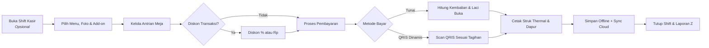

<p align="center">
  
</p>

<h1 align="center"><a href="https://miezlearning.github.io/aristotle-pos/">Aristotle POS</a></h1>

<p align="center">
  <strong>Sistem Kasir Pintar, Modern, dan Skalabel untuk UMKM & Retail F&B Indonesia</strong><br>
  <em>Dirancang dengan filosofi Effortless UI: Sangat mudah digunakan, ramah lansia, 100% offline-first, foto menu visual, dan siap terhubung ke cloud.</em>
</p>

<!-- AUTO-SYNC CORE STATUS BADGES -->
<p align="center">
  <a href="https://github.com/miezlearning/aristotle-pos/releases/latest">
    
  </a>
  <a href="https://github.com/miezlearning/aristotle-pos/actions/workflows/ci-cd.yml">
    
  </a>
  <a href="https://github.com/miezlearning/aristotle-pos/releases/latest/download/Aristotle-POS.apk">
    
  </a>
  <a href="https://miezlearning.github.io/aristotle-pos/">
    
  </a>
  <a href="LICENSE">
    
  </a>
</p>

<!-- REPO ENGAGEMENT & VITAL STATS ROW -->
<p align="center">
  <a href="https://github.com/miezlearning/aristotle-pos/stargazers">
    
  </a>
  <a href="https://github.com/miezlearning/aristotle-pos/network/members">
    
  </a>
  <a href="https://github.com/miezlearning/aristotle-pos/releases">
    
  </a>
  <a href="https://github.com/miezlearning/aristotle-pos">
    
  </a>
  <a href="https://github.com/miezlearning/aristotle-pos/commits/master">
    
  </a>
  <a href="android/app/build.gradle">
    
  </a>
</p>

<!-- QUICK ACTION HERO LINKS -->
<p align="center">
  <a href="https://miezlearning.github.io/aristotle-pos/">🚀 <b>Buka Web App (Live Demo)</b></a> &nbsp;•&nbsp;
  <a href="https://github.com/miezlearning/aristotle-pos/releases/latest/download/Aristotle-POS.apk">📱 <b>Unduh APK Android (Auto-Latest)</b></a> &nbsp;•&nbsp;
  <a href="https://github.com/miezlearning/aristotle-pos/releases">🏷️ <b>Daftar Semua Rilis</b></a> &nbsp;•&nbsp;
  <a href="PANDUAN_EDUKASI_LANSIA.md">📖 <b>Panduan Ramah Lansia</b></a> &nbsp;•&nbsp;
  <a href="CHANGELOG.md">📜 <b>Riwayat Pembaruan</b></a>
</p>

<!-- GITHUB STATS & REPO CARDS WIDGET -->
<p align="center">
  <a href="https://github.com/miezlearning/aristotle-pos">
    
  </a>
  <a href="https://github.com/miezlearning/aristotle-pos">
    
  </a>
</p>

---

## 💡 Tentang Aristotle POS

**Aristotle POS** adalah aplikasi kasir (*Point of Sale*) generasi baru yang dirancang khusus untuk memecahkan kendala digitalisasi UMKM di Indonesia — seperti warung makan, kedai kopi, kedai cemilan, hingga toko kelontong. 

Dibangun dengan arsitektur **Hybrid Modern** (Progressive Web App + Native Android WebView), Aristotle POS memadukan kesederhanaan antarmuka tingkat tinggi (*low cognitive load*) dengan keandalan operasional kelas industri: **bekerja 100% saat tidak ada internet**, serta otomatis menyinkronkan data keuangan antarperangkat ketika online.

---

## 📸 Antarmuka Aplikasi (Showcase)

| Layar Utama Kasir (POS) | Kalkulator Pembayaran & Kembalian Cepat |
| :---: | :---: |
|  |  |
| *Katalog grid responsif, multi-antrian, kartu menu foto visual, dan keranjang live.* | *Pilihan nominal uang pas, kalkulasi kembalian otomatis, diskon, & QRIS.* |

<br>

<p align="center">
  <b>🧾 Pengaturan Hardware Printer Thermal & Pratinjau Struk Nyata (Sticky Live Preview)</b><br>
  <em>Mendukung pencetakan Bluetooth SPP / USB ESC/POS 58mm & 80mm, tiket dapur 🍳, rincian add-on per baris, dan buka laci kasir otomatis.</em>
</p>

<p align="center">
  
</p>

---

## ✨ Fitur Unggulan

- 🖼️ **Foto Menu Produk Visual & Auto-Kompresi Canvas**: Setiap menu kini bisa dilengkapi foto makanan/minuman yang menggugah selera. Foto langsung dari kamera/galeri HP otomatis dikompresi ringan (~20KB) sehingga tetap 100% offline-ready dan hemat kuota.
- ⚡ **100% Offline-First**: Seluruh transaksi, katalog produk, dan laporan tetap berjalan normal tanpa koneksi internet. Data tersimpan aman di perangkat lokal dan otomatis disinkronkan ke cloud saat jaringan tersedia.
- 👵 **Effortless UI (Ramah Lansia)**: Mengadopsi prinsip Google Material Design 3 dengan ukuran tombol sentuh besar (min 48dp), kontras warna tinggi, konfirmasi audio haptik, serta panduan sorot interaktif (*Tour Guide*).
- 📑 **Multi-Antrian Pesanan (*Order Queues*)**: Melayani banyak pelanggan atau nomor meja secara simultan tanpa khawatir pesanan tertukar atau terhapus.
- 🍳 **Add-On Menu & Tiket Dapur (Kitchen Checkpoint)**: Mendukung kustomisasi topping tambahan berbayar/gratis, live kalkulator harga satuan, perincian formula harga di keranjang, dan format cetak khusus koki/barista dengan kotak centang `[  ]`.
- 🖨️ **Integrasi Printer Thermal Sesuai Standar Industri**: Kompatibel dengan printer Bluetooth ESC/POS (58mm/80mm), cetak struk berlogo, rincian matematis harga dasar + add-on yang cocok persis dengan subtotal, kustomisasi spasi hemat kertas, dan perintah buka laci uang kasir (*cash drawer kick*).
- 💳 **QRIS Dinamis EMVCo & Kalkulator Kembalian**: Mengubah QRIS statis toko menjadi QRIS dinamis ber-nominal pas secara instan, dilengkapi kalkulator uang kembalian cepat dan fitur bagi rata (*split bill*).
- 🕒 **Manajemen Shift Kasir & Laporan Z**: Pencatatan modal laci awal (*cash float*), audit rekonsiliasi fisik uang kasir (Pas / Kurang / Lebih), serta cetak rekap Laporan Z resmi tutup toko.
- 👥 **Multi-Perangkat & Multi-Tenant**: Sambungkan HP staf ke kasir utama via Wi-Fi/Hotspot lokal tanpa kuota internet, serta kelola banyak cabang usaha dalam satu aplikasi dengan proteksi 6-digit PIN.
- 📊 **Laporan Finansial & Margin Laba**: Rekap otomatis omzet harian, pencatatan biaya operasional, estimasi laba bersih, serta ekspor pembukuan ke format CSV/Excel.

---

## 🔄 Alur Operasional Kasir



---

## 🛠️ Arsitektur & Teknologi

Aristotle POS dibangun dengan prinsip *zero-overhead dependency* agar ringan, cepat, dan mudah di-maintain:

| Komponen | Teknologi | Keterangan |
| :--- | :--- | :--- |
| **Frontend Core** | HTML5, Vanilla JavaScript (ES Modules) | Tanpa build step yang rumit, eksekusi browser instan |
| **Media & Canvas** | HTML5 Canvas Client-Side Compressor | Kompresi foto menu WebP/JPEG ringan (~20KB) siap offline |
| **Styling & UI** | Tailwind CSS (CDN) + Material Design 3 | Desain modern, responsif untuk layar HP, tablet, & PC |
| **Tipografi & Ikon** | Plus Jakarta Sans & Material Symbols | Tingkat keterbacaan tinggi dan ikonik |
| **Offline Engine** | Service Worker & LocalStorage / IndexedDB | Cache-first architecture untuk keandalan 100% offline |
| **Cloud Realtime** | Firebase Firestore | Sinkronisasi multi-perangkat antar kasir dan owner |
| **Hardware Driver** | Native Android SPP Bluetooth Bridge & Web Serial | Komunikasi direct serial ESC/POS untuk thermal printer |
| **Native Wrapper** | Android Studio (Java 17, SDK 34) | WebView berkecepatan tinggi dengan navigasi tombol Back fisik |

---

## 🚀 Cara Menjalankan & Memasang

### 1. Buka Langsung di Browser (Web PWA)
Akses aplikasi melalui browser di ponsel, tablet, atau komputer:
```text
https://miezlearning.github.io/aristotle-pos/
```
> **Tip:** Tekan tombol **"Install App"** atau menu browser **"Tambahkan ke Layar Utama"** untuk menjadikannya aplikasi mandiri tanpa address bar.

### 2. Pasang di Smartphone Android (APK Native)
1. Unduh paket installer resmi terbaru: **[Aristotle-POS.apk (Auto-Latest)](https://github.com/miezlearning/aristotle-pos/releases/latest/download/Aristotle-POS.apk)**.
2. Buka file APK yang telah diunduh di perangkat Android Anda.
3. Berikan izin instalasi dari sumber tidak dikenal jika diminta sistem.
4. Buka aplikasi **Aristotle POS** langsung dari homescreen.

### 3. Menjalankan di Komputer Lokal (Pengembangan)
Clone repositori ini dan jalankan web server lokal sederhana:
```bash
# Clone repositori
git clone https://github.com/miezlearning/aristotle-pos.git
cd aristotle-pos

# Jalankan web server lokal (menggunakan Python)
python -m http.server 8000
```
Buka browser di `http://localhost:8000`.

---

## ⚡ Portal Super Admin (Monitoring Multi-Cabang)

Bagi pemilik bisnis atau franchise yang memiliki banyak cabang UMKM mitra:
* **Akses Portal:** [`https://miezlearning.github.io/aristotle-pos/?view=superadmin`](https://miezlearning.github.io/aristotle-pos/?view=superadmin)
* **Fungsi Utama:**
  * Memantau akumulasi omzet harian & volume transaksi seluruh cabang secara terpusat.
  * Masuk ke antarmuka kasir toko mitra manapun tanpa input PIN (*One-Click Impersonate*).
  * Bantuan darurat reset 6-digit PIN keamanan bagi mitra toko yang lupa kata sandi.

---

## ⌨️ Pintasan Keyboard (Mode Desktop / PC Kasir)

| Tombol | Tindakan Kasir |
| :---: | :--- |
| <kbd>F2</kbd> | Buka antrian / meja pesanan baru |
| <kbd>F4</kbd> | Buka modal checkout & pembayaran |
| <kbd>Ctrl</kbd> + <kbd>P</kbd> | Cetak ulang struk transaksi terakhir |
| <kbd>Esc</kbd> | Menutup modal dialog / batalkan jendela aktif |

---

## 📚 Tautan Dokumentasi Terkait

* [📘 Panduan Edukasi Ramah Lansia](PANDUAN_EDUKASI_LANSIA.md) — Panduan visual dan langkah operasional kasir untuk pemilik usaha lansia.
* [📜 Riwayat Pembaruan (Changelog Lengkap)](CHANGELOG.md) — Rincian teknis setiap rilis versi dari v1.0 hingga rilis terbaru.
* [📋 Dokumen Kebutuhan Produk (PRD)](PRD.MD) — Spesifikasi dasar, filosofi desain M3, dan arsitektur produk.

---

## 📄 Lisensi

Hak Cipta © 2026 **Aristotle POS Team**.  
Proyek ini didistribusikan di bawah lisensi resmi [MIT License](LICENSE). Bebas digunakan, disesuaikan, dan dikembangkan untuk memajukan ekosistem UMKM Indonesia.
