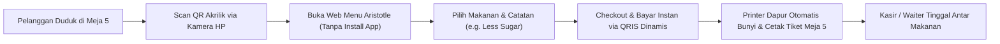

# PANDUAN STRATEGI BISNIS & ANALISIS PASAR ARISTOTLE POS
**Dokumen Analisis Kritis: Model SaaS vs. Hardware Bundling vs. Table QR vs. B2B White-Label & Alternatif Radikal**
*Revisi 2026-09-13: dikoreksi berdasarkan riset regulasi BI & harga pasar; ditambah vonis + 5 jurus out-of-the-box.*

---

## DAFTAR ISI
1. [Executive Summary: Menjawab Kebingungan "Maju Kena Mundur Kena"](#1-executive-summary)
2. [Pembedahan Ide Senior: Model "QRIS di Meja" (Table Self-Ordering)](#2-pembedahan-ide-senior-model-qris-di-meja)
3. [Perbandingan Kritis 3 Model Konvensional](#3-perbandingan-kritis-3-model-konvensional)
4. [Simulasi Finansial & Proyeksi Pendapatan Nyata](#4-simulasi-finansial--proyeksi-pendapatan-nyata)
5. [Strategi Terbaik Lapangan: "The Hybrid Model"](#5-strategi-terbaik-lapangan-the-hybrid-model)
6. [Reality Check: Siapa Karakter Diri Anda Sebenarnya?](#6-reality-check-siapa-karakter-diri-anda-sebenarnya)
7. [4 Saran Alternatif yang Jauh Lebih "Worth It" & Bernilai Tinggi](#7-4-saran-alternatif-yang-jauh-lebih-worth-it--bernilai-tinggi)
   - [Alternatif A: B2B White-Label ke Pemilik Franchise / Kemitraan F&B](#alternatif-a-b2b-white-label-ke-pemilik-franchise--kemitraan-fb)
   - [Alternatif B: Jual Source Code / Boilerplate ke Developer Lain](#alternatif-b-jual-source-code--boilerplate-ke-developer-lain)
   - [Alternatif C: POS Sebagai "Trojan Horse" Agensi Digital Lokal](#alternatif-c-pos-sebagai-trojan-horse-agensi-digital-lokal)
   - [Alternatif D: Pivot ke Sektor Non-F&B yang Anti-Churn](#alternatif-d-pivot-ke-sektor-non-fb-yang-anti-churn)
8. [Matriks Perbandingan Lengkap: Mana yang Cocok Buat Anda?](#8-matriks-perbandingan-lengkap-mana-yang-cocok-buat-anda)
9. [Roadmap Eksekusi 30 Hari Pertama (Action Plan)](#9-roadmap-eksekusi-30-hari-pertama)
10. [Vonis: Urutan Worth-It Menurut Data (Revisi 2026)](#10-vonis-urutan-worth-it-menurut-data-revisi-2026)
11. [5 Jurus Out-of-the-Box: Paling Menguntungkan (Revisi 2026)](#11-5-jurus-out-of-the-box-paling-menguntungkan-revisi-2026)

---

## 1. EXECUTIVE SUMMARY

Rasa bingung dan perasaan *"maju kena mundur kena"* yang Anda alami adalah **dilema paling nyata dari ribuan developer software di Indonesia**. 

* **Kenapa terasa maju kena mundur kena?**
  * Mau jalanin **Murni SaaS (Software Langganan Bulanan)**: Takut tidak laku karena UMKM benci langganan, churn tinggi, dan capek hadapi komplain teknis demi uang Rp 50.000/bulan.
  * Mau jalanin **Sewa Alat / HaaS (Hardware as a Service)**: Takut modal habis untuk beli tablet/printer, takut alat dirusak atau dibawa kabur saat warung sepi.
  * Mau jalanin **Jual Putus Alat**: Bingung bagaimana cara dapat penghasilan rutin (recurring income) ke depannya.

**Fakta Kunci:**  
Software Anda (**Aristotle POS**) sudah memiliki arsitektur yang sangat bagus: *offline-first*, *real-time cloud sync*, *tiket dapur*, dan *manajemen antrean*. Yang Anda butuhkan sekarang bukanlah menambah 50 fitur baru di kodingan, melainkan **menentukan model bisnis yang cocok dengan kapasitas modal, mental, dan kepribadian Anda**.

---

## 2. PEMBEDAHAN IDE SENIOR: MODEL "QRIS DI MEJA" (TABLE SELF-ORDERING)

Maksud dari senior Anda:
> *"Semua disiapkan oleh kita (stand akrilik QR di meja + sistem kasir), merchant tidak bayar lisensi mahal, kita ambil keuntungan dari biaya layanan pelanggan, merchant senang karena biaya operasional terpangkas."*

Di industri F&B global dan nasional, ini dikenal sebagai **Dine-In QR Self-Ordering / Table Ordering System** (seperti yang dipakai oleh *ESB Order, Opaper, Runchise, atau MejaKita*).

### A. Alur Kerja (Workflow) di Lapangan:


### B. Sumber Keuntungan (Monetisasi) — KOREKSI REGULASI 2026:
> ⚠️ **Koreksi penting hasil riset regulasi BI (jangan jalankan versi lama):**
> * **DILARANG membebankan biaya layanan ke pembeli di atas QRIS.** MDR QRIS ditanggung merchant dan dilarang dibebankan ke konsumen (UMI ≤Rp500rb = 0%, >Rp500rb = 0,3%, reguler 0,7%; per 1 Okt 2026, 0% diperluas ke ≤Rp100rb semua merchant). Skema "checkout + Rp1.000 fee ke pembeli" melanggar aturan.
> * **MDR sharing hanya bisa jika Anda di rantai settlement.** BI tidak mengambil sepeser pun dari MDR — uang mengalir ke issuer/acquirer/switching. Untuk ikut memotong aliran transaksi Anda harus jadi **PJP berlisensi BI**: badan hukum PT + modal disetor **Rp5–15 MILIAR** + fit & proper test + laporan berkala. Bukan dunia solo developer.
> * **Satu-satunya jalur realistis:** kemitraan referral/platform dengan agregator berlisensi (pola Xendit: referral agreement + API onboarding/KYC sub-merchant; komisi triwulanan, umumnya dibatasi ±12 bulan, butuh volume). Itu mesin tahap 2 — bukan fondasi.

Monetisasi Table QR yang sah menurut standar industri (ditiru Moka & Majoo):
1. **Langganan fitur Dine-In ke merchant** (Moka mematok ±Rp99rb/bulan untuk QR menu/order; Majoo memasukkan table order ke paket langganannya). Merchant yang bayar — bukan pembeli.
2. **Setup fee + payment fee via agregator resmi** — dengan catatan margin tipis dan butuh volume.
3. **Modul yang belum ada dan wajib dibangun dulu:** web menu publik untuk pelanggan (katalog publik, keranjang anonim, anti order fiktif ke dapur, status pesanan). Biayanya bukan "Rp150rb akrilik".

### C. Mengapa Pemilik Cafe/Resto Sangat Menyukainya?
1. **Hemat Gaji Karyawan:** 1 cafe dengan 20 meja biasanya butuh 3-4 waiter. Dengan QR meja, cukup 1-2 waiter untuk antar makanan saja. Menghemat Rp 2.000.000 - Rp 4.000.000/bulan gaji pelayan!
2. **Nol Resiko Biaya:** Toko tidak merasa "dipalak" uang langganan software tiap bulan.
3. **Peningkatan Omset (Average Order Value):** Pelanggan bebas melihat foto menu tanpa merasa diburu-buru oleh pelayan yang berdiri di samping meja.

---

## 3. PERBANDINGAN KRITIS 3 MODEL KONVENSIONAL

| Parameter | Model 1: Murni SaaS Online | Model 2: Bundling Hardware (Jual Putus) | Model 3: Table QR Ordering (Saran Senior) |
| :--- | :--- | :--- | :--- |
| **Bentuk Produk** | Aplikasi diunduh sendiri oleh pengguna | 1 Paket: Tablet + Printer + Software Kasir | Akrilik QR di Meja + Web Menu + Tiket Dapur |
| **Modal Awal Anda** | Rp 0 (Hanya biaya server/Firebase) | Rp 1,7 jt - Rp 2 jt per unit barang | Sangat murah: Cetak akrilik meja (~Rp 150rb/toko) |
| **Harga Jual ke Toko** | Rp 49.000 - Rp 99.000 / bulan | Rp 2.800.000 - Rp 3.500.000 (sekali bayar) | Gratis / Setup Fee Ringan (Rp 300rb - Rp 500rb) |
| **Keuntungan Anda** | Lambat (Rp 50rb/bln/toko) | Cepat (Untung bersih Rp 1 jt - Rp 1,5 jt per toko) | Pasif berulang (Rp 1.000 per transaksi) |
| **Resistensi Penjualan** | Sangat Tinggi (UMKM pelit langganan) | Rendah (UMKM suka beli barang fisik) | Sangat Rendah (Merchant merasa tidak rugi) |
| **Tingkat Churn (Batal)** | Sangat Tinggi (30% - 50% per tahun) | Rendah (Barang sudah dibeli, dipakai terus) | Rendah jika cafe ramai pengunjung |
| **Beban Support Teknis** | Sangat Tinggi (Semua device orang beda-beda) | Sedang (Device standar yang Anda pilihkan) | Rendah (Web ringan di HP pelanggan) |

---

## 4. SIMULASI FINANSIAL & PROYEKSI PENDAPATAN NYATA

Skenario dengan target memegang **10 Klien Cafe/Resto Lokal**:

### Skenario A: Murni SaaS (Rp 75.000 / bulan)
* 10 Toko x Rp 75.000 = **Rp 750.000 / bulan**.
* *Kenyataan:* Anda menghabiskan puluhan jam customer service sebulan hanya untuk uang yang tidak cukup bayar bensin dan internet.

### Skenario B: Bundling Hardware (Jual Putus)
* 10 Toko beli paket mesin kasir lengkap @ Rp 3.200.000.
* Modal hardware Anda: 10 x Rp 1.800.000 = Rp 18.000.000.
* **Keuntungan Bersih Seketika: 10 x Rp 1.400.000 = Rp 14.000.000 CASH di tangan!**
* Ditambah perpanjangan lisensi tahunan tahun ke-2: 10 x Rp 400.000 = Rp 4.000.000 / tahun.

### Skenario C: Table QR Self-Ordering (Saran Senior) — DENGAN KOREKSI:
* Asumsi 1 Cafe memiliki 15 meja.
* Rata-rata 50 transaksi QR per hari per cafe = 1.500 transaksi per bulan.
* **Koreksi 1 — tidak ada Rp1.000/transaksi pasif:** uang QRIS settlement masuk ke rekening merchant, bukan ke Anda. Tanpa lisensi PJP, fee itu tidak bisa terpotong otomatis — Anda tetap harus menagih merchant (masalah yang sama dengan SaaS bulanan).
* **Koreksi 2 — uji sensitivitas:** jika hanya 10 transaksi/hari (jauh lebih realistis untuk cafe sepi), maka 300 transaksi/bulan. Dengan langganan Dine-In Rp99rb/bulan ala Moka, laba per cafe ≈ Rp99rb — bukan Rp1.050.000. Selisih 10x lipat dari klaim lama.
* **Keputusan:** model ini **DIPARKIR** sampai (a) ada merchant yang membayar DP setup minimal Rp2jt (satu-satunya validasi yang sah), dan (b) ada MoU kemitraan agregator. Detail eksekusi ada di `STRATEGI_EKSEKUSI_POS.md`.

---

## 5. STRATEGI TERBAIK LAPANGAN: "THE HYBRID MODEL"

Jangan memilih salah satu, **gabungkan keduanya**:

```
                  ┌──────────────────────────────────────────────┐
                  │          THE HYBRID ARISTOTLE POS            │
                  └──────────────────────┬───────────────────────┘
                                         │
                 ┌───────────────────────┴───────────────────────┐
                 ▼                                               ▼
     [ PAKET HARDWARE KASIR ]                        [ EKOSISTEM QR MEJA ]
  (Sumber Uang Tunai di Depan)                    (Sumber Passive Recurring Bulanan)
  • Tablet Android + Printer + Stand             • Akrilik QR di tiap meja (Meja 1-20)
  • Dijual putus Rp 2,8 jt - Rp 3,5 jt           • Pelanggan scan, pesan & bayar QRIS
  • Cuan langsung Rp 1 jt - Rp 1,5 jt / toko     • Fee Rp 1.000/order masuk ke Anda
  • Toko merasa punya aset fisik resmi           • Dapur langsung cetak tiket otomatis
```

* **Hari Pertama:** Anda langsung untung jutaan rupiah dari penjualan hardware + jasa setup menu.
* **Tiap Hari Berikutnya:** Anda terus dapat pemasukan pasif dari tiap transaksi QRIS di meja-meja cafe tersebut.
* **Untuk Pembeli Tunai:** Kasir fisik di meja depan siap melayani pesanan manual cash.

> ⚠️ **Revisi 2026:** kaki "QR Meja" pada model hybrid ini statusnya **DIPARKIR** (lihat koreksi regulasi di Bagian 2B dan 4). Kaki yang jalan duluan = paket kasir + lisensi lifetime + jasa setup. Kaki QR dibangun hanya jika ada DP setup merchant + partner agregator. Rencana eksekusi 90 hari yang sudah dikoreksi ada di `STRATEGI_EKSEKUSI_POS.md`.

---

## 6. REALITY CHECK: SIAPA KARAKTER DIRI ANDA SEBENARNYA?

Sebelum memilih jalan bisnis, jawab pertanyaan paling jujur ini:
> **"Apakah Anda tipe orang yang suka datang ke toko orang asing, ngobrol santai, presentasi demo, dan siap ditelepon malam-malam saat printer toko mereka macet?"**

1. **Jika Jawabannya TIDAK (Anda murni developer/introvert):**
   * Menjual langsung ke warung/cafe lokal akan membuat Anda **stres berat dan burn-out**. 
   * Masalah UMKM 80% bukan soal kehebatan koding, tapi edukasi orang gaptek, kesabaran melayani, dan sales fisik.
   * Anda sebaiknya memilih **Alternatif A (B2B Franchise)** atau **Alternatif B (Jual Source Code/Developer Tools)**.
2. **Jika Jawabannya YA (Anda menikmati networking, jualan, dan terjun ke lapangan):**
   * Model Hybrid (Kasir Fisik + QR Meja) adalah tambang emas lokal untuk Anda.

---

## 7. 4 SARAN ALTERNATIF YANG JAUH LEBIH "WORTH IT" & BERNILAI TINGGI

Jika Anda merasa model jualan ke warung eceran terlalu melelahkan, pertimbangkan 4 jalur alternatif ini:

---

### Alternatif A: B2B White-Label ke Pemilik Franchise / Kemitraan F&B
> **Prinsip:** Jangan closing 1 warung. Closing 1 orang bos franchise, dapat 30 gerai sekaligus!
> **Revisi 2026 — pertajam jadi "Royalti Guard":** jangan jual "aplikasi kasir" ke pemilik franchise. Jual **bukti mitra tidak mencuri**: tiap transaksi tercatat di dashboard pusat, royalti terhitung otomatis, rekap harian masuk WA owner. Pembelinya punya uang DAN punya rasa sakit. Harga: setup Rp15–25jt + Rp2jt/bulan dibayar *kantor pusat*. Modal bangun kecil — mesin laporan + Super Admin dashboard sudah ada, tinggal tambah hitung royalti % + rekap WA harian. Lihat Jurus #1 di Bagian 11.

* **Masalah Besar Pemilik Franchise:**
  Pemilik kemitraan (franchise es teh, kopi susu, atau ayam fried chicken gerobakan yang punya 15–50 cabang) pusing karena **mitra cabangnya sering tidak jujur**:
  * Mitra beli cup/bahan baku dari pasar luar, bukan dari pusat.
  * Mitra memanipulasi laporan omset harian agar tidak bayar royalti.
* **Solusi Aristotle POS White-Label:**
  * Anda ganti branding aplikasi menjadi **"Sistem Kasir Resmi Franchise X"**.
  * Berikan **Super Admin Dashboard** ke kantor pusat untuk memantau stok bahan baku dan omset seluruh cabang secara real-time.
  * Kantor pusat mewajibkan setiap mitra baru membeli paket tablet kasir ini sebagai syarat buka cabang.
* **Keuntungan Buat Anda:**
  * Closing 1 pemilik franchise = **Omset Proyek Rp 15.000.000 – Rp 35.000.000** (Setup fee B2B).
  * Biaya langganan server tahunan dibayar langsung oleh kantor pusat.
  * Masalah operasional harian ditangani tim franchise mereka, bukan langsung ke Anda.

---

### Alternatif B: Jual Source Code / Boilerplate ke Developer Lain
> **Prinsip:** Berhenti jualan ke orang gaptek. Jual ke sesama programmer & Software House!

* **Fakta Kebutuhan Pasar Developer:**
  Ribuan freelance developer dan software house di Indonesia & global sering mendapat proyek bikin POS dari klien. Tapi membuat:
  1. Driver printing thermal ESC/POS (Bluetooth SPP, USB, Android Spooler) yang stabil tanpa error.
  2. Arsitektur offline-first dengan real-time Firestore sync.
  3. UI responsif PWA + WebView Android hybrid.
  ...membutuhkan waktu **3 hingga 6 bulan riset yang sangat menguras tenaga**.
* **Skema Penjualan:**
  * Jual source code Aristotle POS sebagai **"Production-Ready POS Starter Kit / Boilerplate"** di platform seperti Gumroad, CodeCanyon, atau website mandiri.
  * Harga: **Rp 750.000 – Rp 2.500.000 per lisensi developer** ($49 – $149 USD jika dipasarkan global).
  * Cukup jual ke 25 developer = **Rp 20.000.000 – Rp 50.000.000 uang bersih tanpa modal barang fisik!**
* **Keuntungan:**
  * **Nol urusan printer rusak di warung orang.**
  * Pembelinya paham koding dan tidak perlu diajari cara hidupkan bluetooth.

---

### Alternatif C: POS Sebagai "Trojan Horse" Agensi Digital Lokal
> **Prinsip:** Software kasir diberikan gratis/murah, uang aslinya dari jasa digital bernilai tinggi.

Pemilik resto/cafe sering enggan bayar software, tetapi mereka rela bayar jutaan rupiah untuk hal-hal yang **terbukti menambah omset**:

1. **Jasa Setup & Optimasi Google Maps / SEO Lokal:** (Rp 1.000.000 – Rp 2.000.000). Banyak cafe bagus yang tidak muncul di Google Maps atau ratingnya berantakan.
2. **Jasa Onboarding & Integrasi Merchant Food Delivery:** (Rp 750.000 – Rp 1.500.000). Mengurus verifikasi dokumen GoFood, GrabFood, dan ShopeeFood yang rumit bagi orang tua.
3. **Jasa Foto Menu & Social Media Kit:** (Rp 1.000.000 – Rp 3.000.000).

> Di model ini, Aristotle POS hanyalah alat untuk **membangun kepercayaan di awal (trust builder)**. Uang tebalnya datang dari jasa agensi di baliknya.

---

### Alternatif D: Pivot ke Sektor Non-F&B yang Anti-Churn & Margin Tebal
> **Prinsip:** F&B itu musiman dan mudah tutup. Lirik sektor jasa yang cashflow-nya stabil dan jarang bangkrut.

1. **Bengkel Motor / Mobil & Cuci Kendaraan:**
   * Butuh cetak estimasi biaya jasa mekanik, nomor antrean kendaraan, dan pembagian komisi montir.
   * Margin bengkel tebal dan mereka sangat jarang tutup dibanding kedai kopi.
2. **Laundry Kiloan & Satuan:**
   * Butuh cetak nomor rak penyimpanan pakaian, status cuci/setrika/siap diambil, dan kirim notifikasi WhatsApp ke pelanggan saat baju selesai.
   * Pemilik laundry sangat loyal dan malas ganti software kalau data pakaian pelanggannya sudah rapi.
3. **Barbershop & Salon Kecantikan:**
   * Butuh bagi hasil komisi tukang cukur (capster), rekap uang tip kasir, dan booking jam potong rambut.

---

## 8. MATRIKS PERBANDINGAN LENGKAP: MANA YANG COCOK BUAT ANDA?

| Model Bisnis | Modal Awal | Kesulitan Sales | Beban Support Teknis | Potensi Penghasilan | Cocok Untuk Siapa? |
| :--- | :---: | :---: | :---: | :---: | :--- |
| **1. Murni SaaS Online** | Nol | Sangat Berat | Sangat Tinggi | Kecil & Lambat | VC-backed startup dengan budget iklan besar. |
| **2. The Hybrid (Hardware + QR)** | Sedang | Menengah | Sedang | Cepat & Pasif Bulanan | Founder yang suka networking & jualan di kota sendiri. |
| **3. B2B White-Label Franchise** | Nol | Butuh Koneksi | Rendah | Besar (Jutaan/Closing) | Founder yang punya kenalan pemilik kemitraan/franchise. |
| **4. Jual Source Code / Starter Kit** | Nol | Mudah (Online) | Sangat Rendah | Cepat & Bersih | Developer introvert yang ingin fokus di depan laptop. |
| **5. Digital Agency + POS** | Nol | Menengah | Rendah | Besar per Klien | Founder yang punya keahlian marketing/desain. |
| **6. Royalti Guard (Jurus #1)** | Nol | Butuh 3 proposal | Sangat Rendah (ditanggung HQ) | Terbesar per closing | Semua tipe — surat 1 halaman, bukan kunjungan massal. |
| **7. Grosir Lisensi Reseller (Jurus #2)** | Nol | Mudah (3 toko dulu) | Didelegasikan ke reseller | Besar & skala tanpa tambah support | Semua tipe — reseller yang jualan & support. |
| **8. Jasa Onboarding QRIS (Jurus #3)** | Nol | Mudah (5 warung) | Rendah | Fee + komisi agregator | Founder yang mau urus dokumen 1–2 jam/klien. |
| **9. Rental Event (Jurus #4)** | Nol (pakai unit demo) | Mudah (1 panitia) | Nol (Anda operatornya) | Kas mingguan + iklan berbayar | Semua tipe — kerja Sabtu-Minggu saja. |

---

## 9. ROADMAP EKSEKUSI 30 HARI PERTAMA

Agar tidak berputar-putar dalam teori, lakukan tes pasar nyata dalam 7–14 hari ke depan:

### Tahap 1: Validasi Lapangan (7 Hari)
1. Siapkan 1 tablet pribadi + 1 printer thermal Bluetooth kecil sebagai unit demo.
2. Siapkan 2 stand akrilik meja bertuliskan: *"Scan untuk Pesan & Bayar (Meja 01)"*.
3. Datangi 3 pemilik usaha kuliner kenalan Anda. Demo langsung cara pesan dari meja dan cetak tiket dapur otomatis.
4. Perhatikan reaksinya: Apakah mereka antusias? Bagian mana yang paling mereka sukai?

### Tahap 2: Validasi Online / Komunitas Developer (7 Hari)
1. Rekam video layar 60 detik yang memperlihatkan keunggulan Aristotle POS:
   * Cetak printer thermal Bluetooth dalam 0.5 detik.
   * Mode offline tetap bisa transaksi saat internet mati.
   * Real-time sync pesanan dari HP pembeli ke tablet kasir.
2. Posting di LinkedIn / X (Twitter) / grup Facebook programmer:
   > *"Habis ngerjain POS offline-first PWA + Android dengan Bluetooth ESC/POS printer driver yang stabil. Kalau ada teman-teman dev/software house yang butuh source codenya buat proyek klien kasir, boleh DM ya."*
3. Lihat responnya: Berapa orang yang tertarik membeli source code Anda?

### Tahap 3: Pilih Pemenang Berdasarkan Bukti Uang
Jalani jalur mana yang **paling cepat memberikan transaksi/uang pertama** kepada Anda. Jangan berasumsi di kepala; biarkan respon pasar nyata yang menentukan arah bisnis Anda!

> ⚠️ **Revisi 2026:** peta 30 hari di atas tetap valid sebagai *tes awal*, tetapi keputusan model final memakai data 90 hari (konversi demo→bayar, jam support/toko, jawaban penolakan). Rencana 90 hari minggu-per-minggu + matematika batas support + template WA follow-up ada di `STRATEGI_EKSEKUSI_POS.md`. Aturan tambahan: **Table QR tidak dibangun tanpa DP setup merchant minimal Rp2jt** — DP adalah satu-satunya validasi yang sah untuk fitur itu.

---

## 10. VONIS: URUTAN WORTH-IT MENURUT DATA (REVISI 2026)

Prinsip penilaiannya satu: **rupiah per jam kerja + siapa yang angkat telepon saat ada masalah.**

1. **White-Label Franchise / "Royalti Guard" = paling worth it per jam.** Pembeli (kantor pusat) punya uang dan rasa sakit; support harian ditanggung tim mereka. Satu closing = belasan juta. Butuh koneksi ke 1 pemilik kemitraan — jika tidak punya, bangun lewat Jurus #5 (program dinas) yang mempertemukan Anda dengan puluhan owner sekaligus.
2. **Lifetime direct ke UMKM = mesin validasi + kas.** Wajib jalan (TRP: tanpa ini Anda tidak tahu konversi demo→bayar), tapi jangan jadi andalan utama — tiap toko = potensi telepon malam hari. Harus direkayasa agar support ≈ nol: SLA tertulis, video tutorial, dan kanal reseller (Jurus #2) yang mendelegasikan support ke pihak yang dibayar margin.
3. **Source code = tiket lotre murah.** Pasang listing, lupakan, cek sebulan sekali. Jangan habiskan >10% waktu di sini sebelum mesin 1–2 jalan.
4. **Table QR + fee transaksi = parkir.** Butuh modal lisensi PJP miliaran rupiah atau MoU agregator + modul self-order yang belum ada. Bukan prioritas 90 hari.

---

## 11. 5 JURUS OUT-OF-THE-BOX: PALING MENGUNTUNGKAN (REVISI 2026)

> Benang merahnya: **berhenti menjual software ke orang yang tidak punya uang. Jual uang ke orang yang punya uang** — royalti yang bocor, omzet event, anggaran program, margin reseller.

### Jurus #1 — "Royalti Guard": jual anti-maling, bukan jual kasir ⭐ Mesin utama
* **Mekanisme:** dashboard pusat + hitung royalti otomatis + rekap WA harian ke owner franchise. Mitra tidak bisa lagi memanipulasi omset.
* **Uang:** setup Rp15–25jt + Rp2jt/bulan dari kantor pusat. Satu closing mengalahkan 10 lisensi retail.
* **Modal bangun:** kecil (laporan + Super Admin sudah ada).
* **Langkah pertama minggu ini:** 1 halaman penawaran "Berapa royalti yang bocor tiap bulan?" ke 3 pemilik kemitraan. Jangan koding dulu.
* **Jebakan:** jangan custom berlebihan per franchise sebelum ada DP — satu template untuk semua.

### Jurus #2 — Grosir lisensi via tukang servis & toko komputer ⭐ Mesin utama
* **Mekanisme:** jual *kredit lisensi grosir* (beli Rp500rb, jual Rp2,5jt sebagai "POS buatan toko kami", rebrand). Sistem generator lisensi Anda sudah mendukung ini.
* **Kenapa mematikan:** (a) CAC nol — mereka bertemu pelanggan tepat saat beli printer; (b) support didelegasikan ke pihak yang dibayar margin Rp2jt; (c) trust transfer dari toko langganan.
* **Penguat:** "sertifikasi teknisi kasir" 1 hari (Rp500rb/peserta) = uang training + mencetak salesforce.
* **Langkah pertama:** tawarkan 1 kredit gratis ke 3 toko komputer/printer untuk dicoba ke 1 pelanggan mereka. Satu closing = pola terbukti.
* **Jebakan:** seleksi reseller (yang sudah jual printer, bukan yang baru mau coba-coba).

### Jurus #3 — Jual jasa onboarding QRIS, software-nya bonus
* **Mekanisme:** penderitaan warung terbesar bukan kasir, tapi *daftar QRIS* (dokumen, NMID, verifikasi). Jual "QRIS beres + kasir terintegrasi" Rp200–300rb; daftarkan mereka via agregator berlisensi (dapat komisi referral per merchant aktif); fitur QRIS dinamis Anda yang mengunci mereka.
* **Uang:** double-dip — fee jasa di depan + komisi agregator di belakang. Tanpa lisensi PJP.
* **Langkah pertama:** daftar jadi referral/partner ke 1 agregator (Xendit/Midtrans/DOKU), jual jasa ini ke 5 warung kenalan.

### Jurus #4 — Rental event: kasir bazar akhir pekan
* **Mekanisme:** sewakan 1 set HP+printer+operator Rp150–300rb/event (bazar, CFD, kantin sekolah, katering hajatan). Anda operatornya.
* **Kenapa cerdas:** margin tinggi, risiko support NOL, dan tiap event = demo live di depan puluhan pemilik usaha. Iklan yang *dibayar*.
* **Langkah pertama:** tawarkan gratis ke 1 panitia bazar akhir pekan ini dengan syarat boleh pasang banner kecil.

### Jurus #5 — Menunggang anggaran program UMKM (B2G2C)
* **Mekanisme:** Dinas Koperasi/UKM punya anggaran digitalisasi (pelatihan + toolkit). Preseden: Majoo masuk via SMESCO. Proposal "Program 50 Warung Go-Digital": dinas bayar paket (lisensi + training massal 1 hari untuk 50 warung sekaligus = support 50 toko dalam 1 hari, bukan 50 kunjungan).
* **Uang:** satu deal = puluhan merchant + dibayar program + liputan media lokal gratis.
* **Langkah pertama:** cari jadwal pelatihan UMKM di dinas kota Anda, datang bawa unit demo, minta slot demo 15 menit.

**Kombinasi 90 hari yang disarankan:** Jurus #2 sebagai mesin utama + Jurus #1 sebagai tombak tiket besar + Jurus #4 sebagai kas mingguan/iklan berbayar. Jurus #3 dan #5 sebagai pengikut. Detail minggu-per-minggu di `STRATEGI_EKSEKUSI_POS.md`.

---

*Dokumen ini diperbarui khusus untuk perencanaan arah produk dan strategi komersialisasi Aristotle POS. Jika data lapangan (konversi, jam support, jawaban penolakan) bertentangan dengan isi dokumen ini — ikuti data lapangan.*
